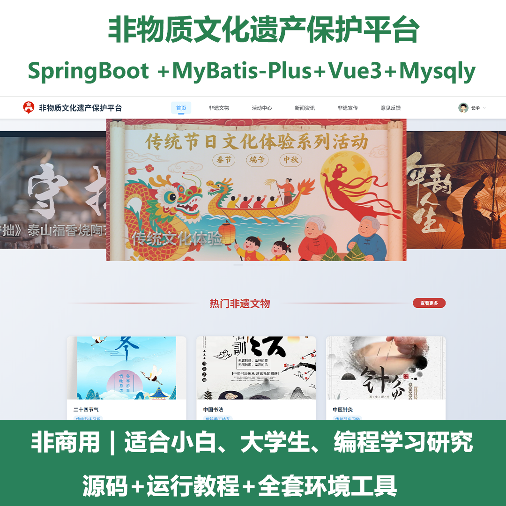
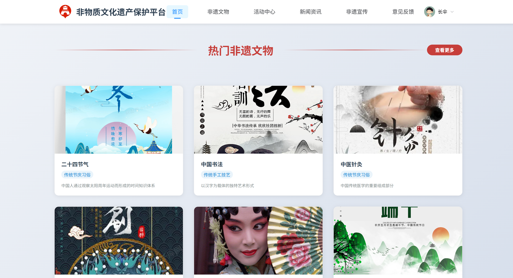
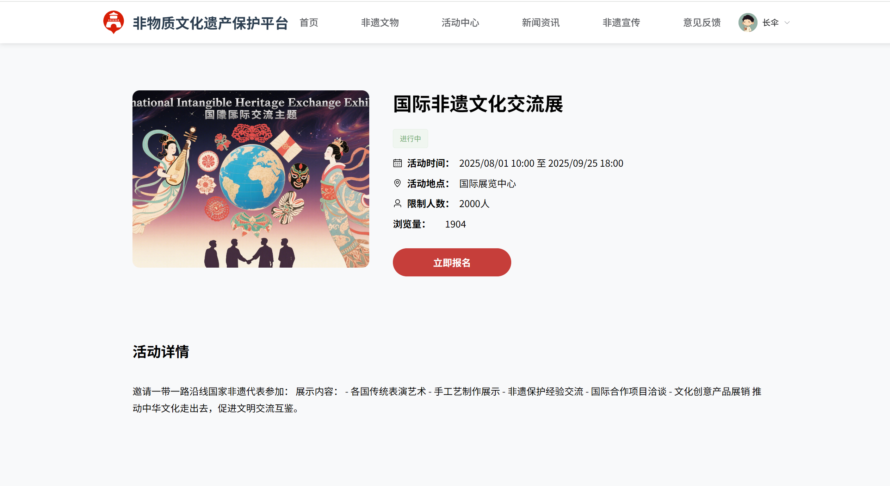
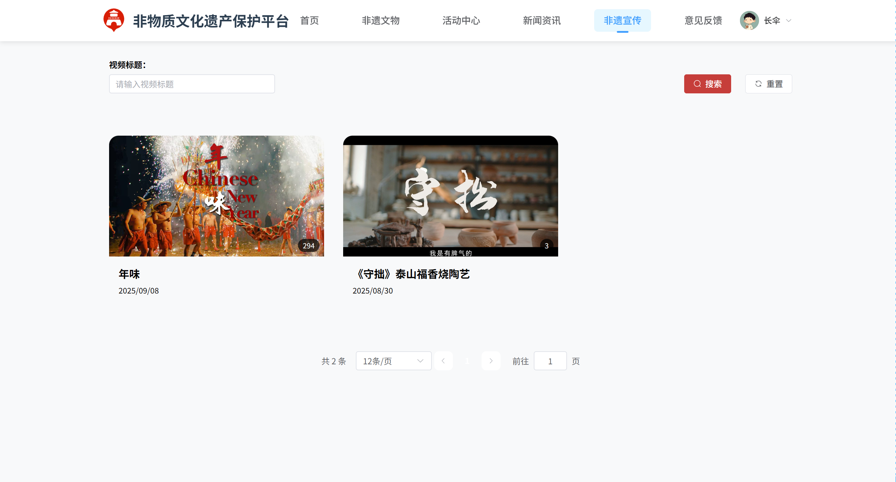
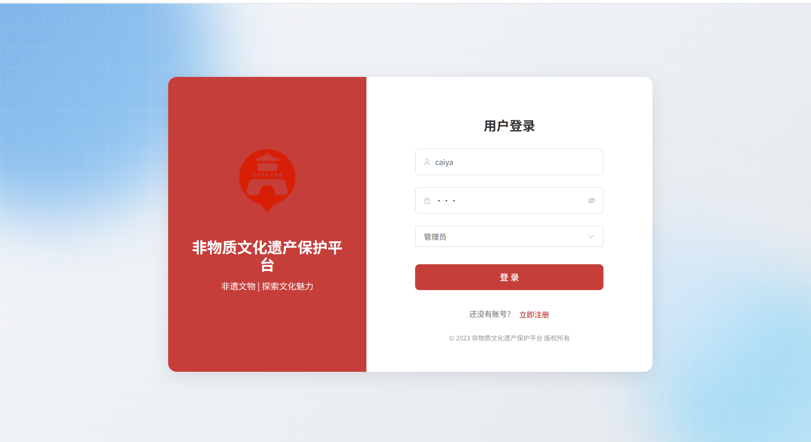
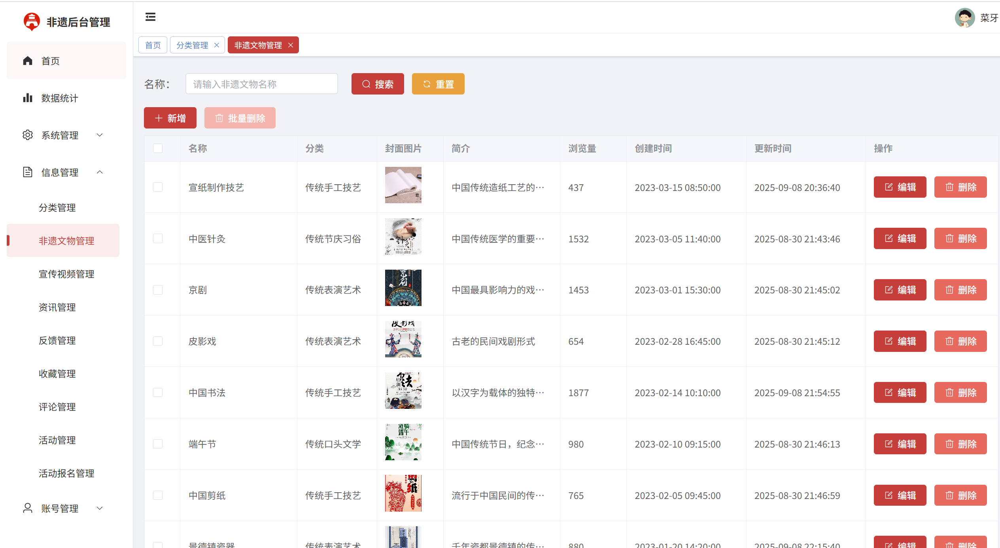
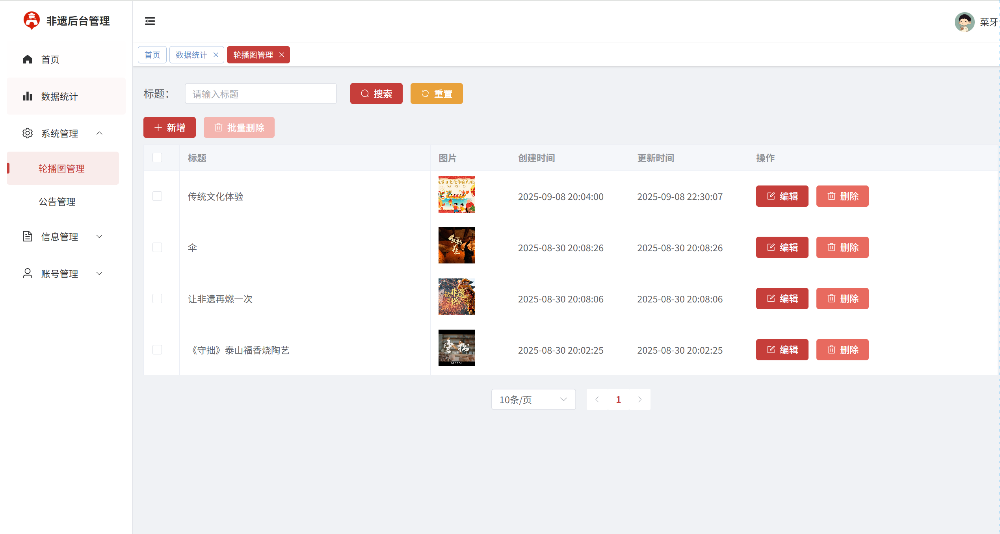
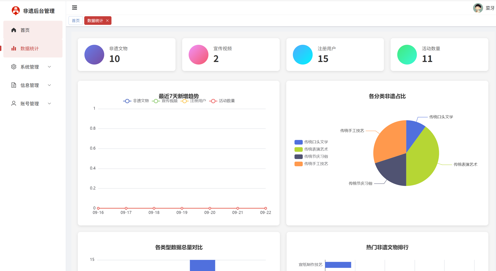
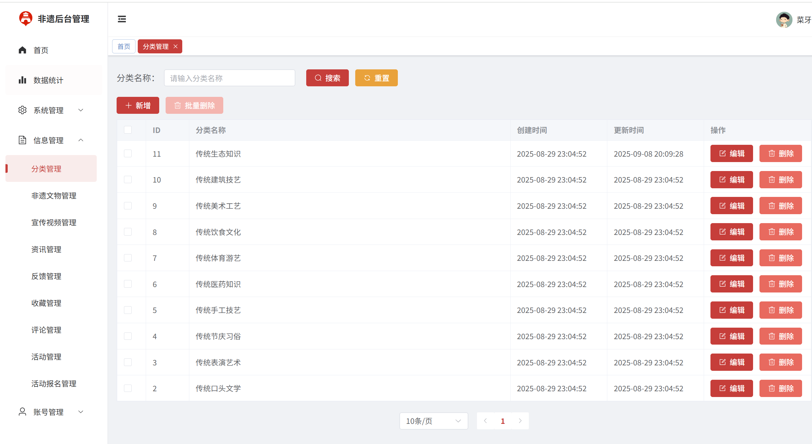

# springbootA532
springbootA532非物质文化遗产保护平台（Vue3）
 
## 查看主页获取源码

### 一、关键词

非物质文化遗产保护平台，非物质文化遗产系统、文化遗产保护平台

### 二、作品包含

源码+数据库+全套环境和工具资源+部署教程

### 三、项目技术

前端技术：Vue3 + Element Plus + Axios + Pinia + ECharts
数据库：MySQL
后端技术：Java、SpringBoot + MyBatis-Plus + Sa-token

  

### 四、运行环境(以下版本亲测，其他版本未知，请自测)

开发工具：IDEA/eclipse  + vscode

数据库：MySQL8 

数据库管理工具：Navicat10以上版本

环境配置软件： JDK17 + Maven3.6.3

前端Nodejs：18

浏览器：谷歌浏览器

### 五、项目介绍

项目编号：springbootA532

非物质文化遗产保护平台功能齐全、页面UI精美，集成ECharts提供丰富的数据统计图表致力于传统文化的数字化保护与传承。

功能描述
1、登录、注册、修改个人信息、密码管理
2、首页：展示系统概况、浏览公告信息
数据统计
1、集成ECharts制作可视化图表
2、展示系统核心数据统计
3、非遗文物、视频、用户、活动数量统计
4、数据趋势分析图表
系统管理
1、轮播图管理：管理首页轮播展示内容
2、公告管理：发布和管理系统公告信息
信息管理
1、分类管理：管理非遗文物分类体系
2、非遗文物管理：管理非遗文物的详细信息、图片、介绍等
3、宣传视频管理：管理非遗相关的宣传视频资源
4、资讯管理：管理非遗相关的新闻资讯内容
5、反馈管理：处理用户提交的意见反馈
6、收藏管理：管理用户收藏的内容
7、评论管理：管理用户评论信息
8、活动管理：创建和管理非遗文化活动
9、活动报名管理：审核和管理用户活动报名信息
账号管理
1、个人信息：管理个人账户信息
2、用户管理：管理普通用户账户
3、管理员管理：管理系统管理员账户
用户功能
文化浏览
1、浏览非遗文物详细信息
2、观看非遗宣传视频
3、阅读非遗相关资讯新闻
互动功能
1、收藏感兴趣的非遗文物和视频
2、发表评论和互动交流
3、参与文化活动报名
4、提交意见反馈
个人中心
1、管理个人资料信息
2、查看收藏的内容
3、查看参与的活动

### 六、运行截图

